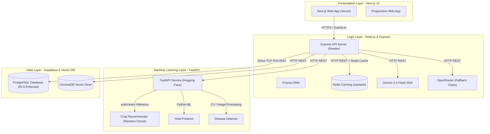
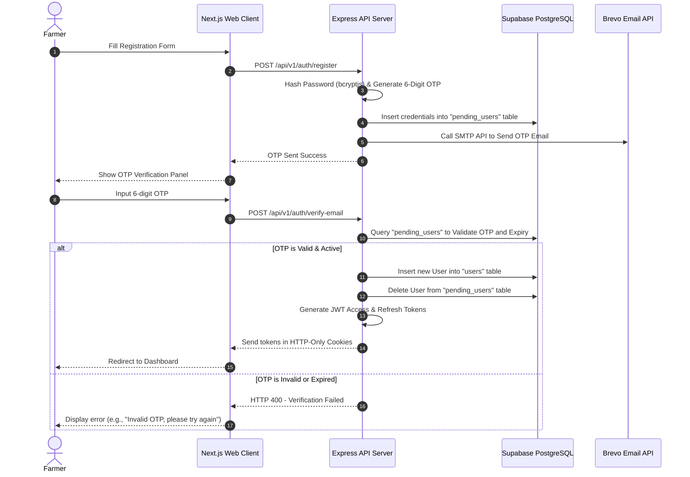
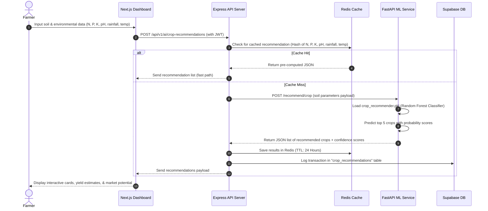
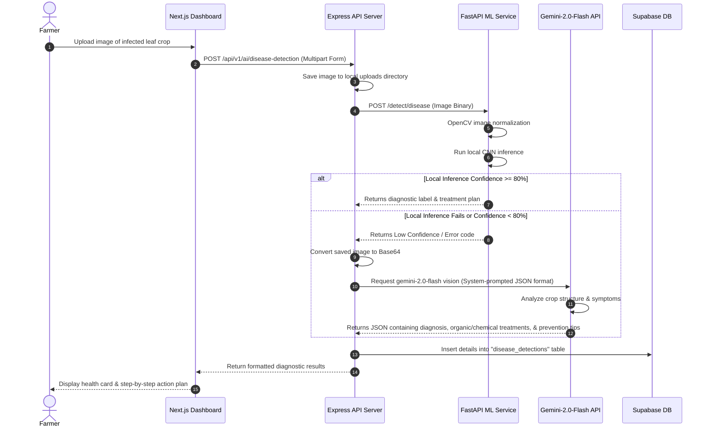
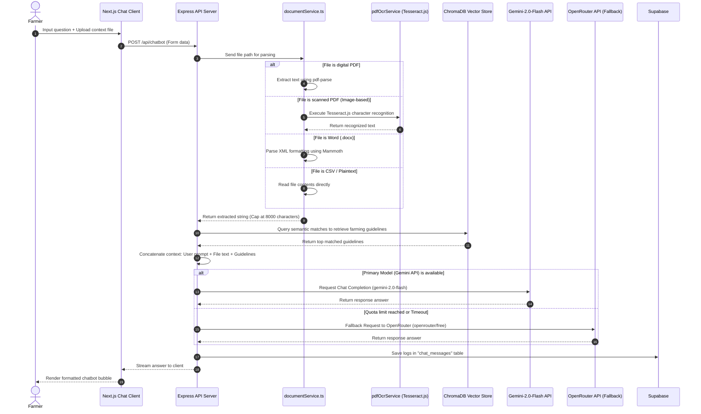
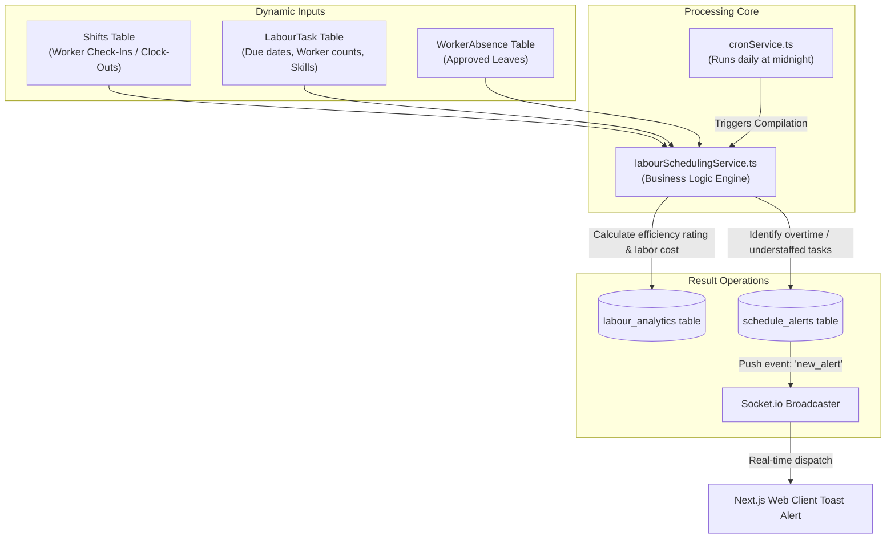

# 🌾 AgriSense: End-to-End Application & Architecture Guide

AgriSense is a premium, AI-powered smart farming platform designed to empower farmers and agricultural experts with data-driven decision-making tools. This document provides an exhaustive, end-to-end explanation of the platform's architecture, processes, data flows, folder structures, database models, and security design.

---

## 📂 1. Workspace Directory Architecture

The AgriSense codebase is organized as a monorepo consisting of a web application frontend, a logical backend API server, and a machine learning service. Below is a map of the folder structures:

```
cropfinally/
├── backend/                   # Node.js + Express + TypeScript API Server
│   ├── prisma/                # Prisma ORM Schema and migrations
│   │   └── schema.prisma      # PostgreSQL Database Schema definition
│   ├── src/
│   │   ├── api/v1/            # API Route handlers organized by category
│   │   │   ├── ai/            # AI features (Crop Recommendation, Yield, Disease, Crop Guide)
│   │   │   ├── auth/          # Authentication & user sessions
│   │   │   ├── community/     # Forums, categories, threads, likes, and replies
│   │   │   ├── farm/          # Farm management routes
│   │   │   ├── market/        # Marketplace listings, reviews, and categories
│   │   │   └── planning/      # Labour scheduling, tasks, and shifts
│   │   ├── config/            # Environment variable configurations
│   │   ├── controllers/       # Legacy controllers
│   │   ├── middleware/        # Express Middlewares (Auth, Error Handler, Validator)
│   │   ├── routes/            # Legacy Express routes
│   │   ├── services/          # Core Business Logic Services
│   │   │   ├── cacheService.ts           # Redis Cache-aside manager
│   │   │   ├── chatHistoryService.ts     # Chat history persistence
│   │   │   ├── cronService.ts            # Scheduled analytics compilation
│   │   │   ├── cropGuideService.ts       # Crop cultivation knowledge generator
│   │   │   ├── documentService.ts        # Chatbot document parser & extractor
│   │   │   ├── forumService.ts           # Forum content management
│   │   │   ├── geminiService.ts          # Google Gemini-2.0-Flash integration
│   │   │   ├── labourSchedulingService.ts# Labour allocation & scheduling
│   │   │   ├── pdfOcrService.ts          # Scanned PDF Tesseract OCR service
│   │   │   ├── socketService.ts          # Socket.io real-time alerts
│   │   │   └── vectorService.ts          # ChromaDB knowledge base sync
│   │   └── index.ts           # Main Express server entry point
│   ├── Dockerfile             # Production container definition
│   └── tsconfig.json          # TypeScript compiler configurations
│
├── frontend/                  # Next.js 14 + Tailwind CSS Presentation Layer
│   ├── app/                   # Next.js App Router folders
│   │   ├── about/             # Info page
│   │   ├── auth/              # Registration, Login, OTP verification pages
│   │   ├── dashboard/         # Main workspace/portal for farmers
│   │   ├── marketplace/       # Peer-to-peer equipment and produce store
│   │   ├── profile/           # User configuration & reputation overview
│   │   ├── weather/           # Forecast & historical climate insights
│   │   ├── globals.css        # Core design system configuration
│   │   └── layout.tsx         # Root layout structure
│   ├── components/            # Reusable UI component modules
│   │   ├── auth/              # Verification panels
│   │   ├── chatbot/           # Chat assistant interface with file-upload widgets
│   │   ├── crop planning/     # Calendar and progress trackers
│   │   ├── labour/            # Shift management, workers list, cost graphs
│   │   ├── marketplace/       # Listing cards, reviews, post listing form
│   │   └── weather/           # Interactive climate widget charts
│   ├── contexts/              # React Context Providers (Auth, Socket)
│   └── package.json           # Node configuration and dependencies
│
└── ml-service/                # Python + FastAPI Machine Learning Service
    ├── models/                # Machine Learning Inference classes
    │   ├── crop_recommender.py# Soil classification (Random Forest)
    │   ├── disease_detector.py# Leaf image classifier
    │   └── yield_predictor.py # Crop production forecasting
    ├── schemas/               # Pydantic Request/Response validation models
    ├── utils/                 # Auxiliary tools (Image processor, loggers)
    ├── main.py                # FastAPI server endpoints
    ├── Dockerfile             # FastAPI deployment container
    └── requirements.txt       # Python dependencies
```

---

## 🏗️ 2. High-Level System Architecture

AgriSense utilizes a decoupled, three-tier service-oriented architecture designed for scalability, security, and low latency.



### Key Service Boundaries
* **Frontend**: A Next.js 14 web application deployed on Vercel. It leverages the App Router, Tailwind CSS, Framer Motion (for premium animations), and Socket.io client (for real-time chat and scheduling alerts).
* **Backend API**: A TypeScript-based Node.js + Express server running on Render. It processes business logic, handles user sessions, manages database operations via Prisma ORM, caches high-frequency queries in Redis, and integrates with generative AI tools (Google Gemini and OpenRouter).
* **ML Service**: A Python-based FastAPI service deployed on Hugging Face Spaces. It handles scikit-learn model inference for recommendations and yield forecasting, and handles computer vision image pre-processing.
* **Database**: PostgreSQL database hosted on Supabase (configured with Row-Level Security) and ChromaDB vector store for AI knowledge indexing.

---

## 💾 3. Database Schema Architecture

The database is built on PostgreSQL via Supabase, managed using Prisma ORM. Below is the relational structure:

### 3.1 User & Farm Management
* **PendingUser (`pending_users` table)**: Temporarily stores user records during the email confirmation phase.
  * Fields: `id`, `email`, `password` (hashed), `firstName`, `lastName`, `phone`, `role` (FARMER, AGRONOMIST, ADMIN), `verificationOtp`, `verificationOtpExpiry`.
* **User (`users` table)**: Verified users who have successfully validated their email OTP.
  * Fields: `id`, `email`, `password`, `firstName`, `lastName`, `phone`, `avatar`, `role`, `verified`, `resetToken`, `resetTokenExpiry`.
  * Relations: Has many `farms`, `recommendations`, `yieldPredictions`, `diseaseDetections`, `calendarTasks`, `forumThreads`, `forumReplies`, `forumLikes`, `marketplaceListings`, `marketplaceReviews`.
* **Farm (`farms` table)**: Agricultural plots associated with a user.
  * Fields: `id`, `name`, `location`, `latitude`, `longitude`, `area` (acres), `soilType`, `irrigationType`, `userId`.

### 3.2 AI & Machine Learning Logs
* **CropRecommendation (`crop_recommendations` table)**: Persists parameters and rankings generated by the Random Forest recommender.
  * Fields: `id`, `userId`, `farmId`, `nitrogen`, `phosphorus`, `potassium`, `ph`, `temperature`, `humidity`, `rainfall`, `season`, `marketDemand`, `recommendations` (JSON array of crops and confidence scores), `confidence`.
* **YieldPrediction (`yield_predictions` table)**: Forecasts estimated crop yield values.
  * Fields: `id`, `userId`, `farmId`, `crop`, `area`, `avgRainfall`, `pesticideUsage`, `temperature`, `pastYields` (JSON), `predictedYield`, `confidenceInterval` (JSON: `{lower: number, upper: number}`), `confidence`.
* **DiseaseDetection (`disease_detections` table)**: Keeps diagnostic histories of plant foliage.
  * Fields: `id`, `userId`, `imagePath`, `cropType`, `diseaseName`, `severity` (LOW, MEDIUM, HIGH), `confidence`, `treatment` (JSON), `annotations` (JSON bounding boxes).

### 3.3 Labour Scheduling & Analytics
* **Worker (`workers` table)**: Farm hands hired by users.
  * Fields: `id`, `userId`, `firstName`, `lastName`, `phone`, `email`, `skills` (string array), `hourlyRate`, `availability` (JSON weekly schedule), `status` (ACTIVE, INACTIVE, ON_LEAVE), `rating`, `totalHours`.
* **LabourTask (`labour_tasks` table)**: Job allocations.
  * Fields: `id`, `userId`, `title`, `description`, `taskType`, `crop`, `location`, `priority` (LOW, MEDIUM, HIGH, CRITICAL), `requiredWorkers`, `requiredSkills` (string array), `estimatedHours`, `startDate`, `endDate`, `status` (PENDING, SCHEDULED, IN_PROGRESS, COMPLETED, DELAYED, CANCELLED), `progress` (0-100).
* **Shift (`shifts` table)**: Scheduled time slots mapping workers to specific tasks.
  * Fields: `id`, `workerId`, `taskId`, `date`, `startTime`, `endTime`, `breakMinutes`, `actualStart`, `actualEnd`, `status` (SCHEDULED, IN_PROGRESS, COMPLETED, CANCELLED, NO_SHOW), `overtimeHours`, `notes`.
* **ScheduleAlert (`schedule_alerts` table)**: Automated scheduling alerts.
  * Fields: `id`, `userId`, `taskId`, `alertType` (UPCOMING_TASK, SHIFT_CHANGE, OVERTIME_WARNING, LABOR_SHORTAGE, WORKER_ABSENCE, TASK_DELAYED, WEATHER_IMPACT), `title`, `message`, `severity` (INFO, WARNING, CRITICAL), `isRead`, `actionRequired`, `metadata` (JSON), `expiresAt`.
* **WorkerAbsence (`worker_absences` table)**: Approved leaves of absence.
  * Fields: `id`, `workerId`, `startDate`, `endDate`, `reason`, `approved`.
* **LabourAnalytics (`labour_analytics` table)**: Compiled daily performance insights.
  * Fields: `id`, `userId`, `date`, `totalWorkers`, `activeWorkers`, `totalHours`, `overtimeHours`, `efficiency` (estimated / actual hours), `costPerHour`, `tasksCompleted`, `tasksDelayed`, `metadata` (JSON).

### 3.4 Community Forums & Marketplace
* **ForumCategory (`forum_categories` table)**: Categorization folders for discussion threads.
  * Fields: `id`, `name`, `slug`, `description`, `icon`, `color`, `order`, `isActive`.
* **ForumThread (`forum_threads` table)**: Primary discussion posts.
  * Fields: `id`, `categoryId`, `authorId`, `title`, `content` (Markdown text), `slug`, `isPinned`, `isLocked`, `viewCount`, `likeCount`, `tags`, `images`, `location`.
* **ForumReply (`forum_replies` table)**: Thread messages, supporting nested responses.
  * Fields: `id`, `threadId`, `authorId`, `content`, `parentId`, `images`, `likeCount`, `isExpert` (marked true for agronomy answers), `isBestAnswer`.
* **ForumLike (`forum_likes` table)**: Ensures users can only like a thread/reply once.
  * Fields: `id`, `userId`, `threadId`, `replyId`.
* **ForumMarketplace (`forum_marketplace` table)**: Peer-to-peer equipment and crop listings.
  * Fields: `id`, `sellerId`, `title`, `description`, `category` (SEEDS, FERTILIZERS, PESTICIDES, MACHINERY, TOOLS, LIVESTOCK, PRODUCE, IRRIGATION, OTHER), `price`, `unit`, `quantity`, `location`, `district`, `state`, `images`, `condition` (NEW, LIKE_NEW, GOOD, FAIR, USED), `status` (AVAILABLE, SOLD, RESERVED, EXPIRED), `contactPhone`, `contactEmail`, `viewCount`, `expiresAt`.
* **UserReputation (`user_reputation` table)**: Dynamic scores mapped to user participation.
  * Fields: `id`, `userId`, `points`, `level`, `badges` (array), `threadsCreated`, `repliesPosted`, `bestAnswers`, `helpfulVotes`.

---

## 🔄 4. End-to-End Core Data Flows

### 4.1 Authentication & Email Verification Process



---

### 4.2 AI Crop Recommendation Flow



---

### 4.3 AI Plant Disease Detection Flow (Dual-Engine Execution)

AgriSense uses a dual-engine diagnostics handler. If the localized Computer Vision engine fails or outputs a low confidence threshold, it triggers a fallback to Gemini Vision.



---

### 4.4 Farming Chatbot & Document Parser Chain

The AI Chatbot allows users to ask questions and upload files (e.g., PDFs, Word docs, CSVs) for contextual processing.



---

### 4.5 Labor Scheduling & Analytics Engine

The scheduling platform manages labor allocations, calculates performance statistics, and triggers warnings via WebSockets (Socket.io) or cron updates.



#### Analytical Formulas
1. **Labor Efficiency ($E$)**:
   $$E = \left( \frac{\text{Estimated Hours required for task}}{\text{Actual Hours logged by workers}} \right) \times 100$$
2. **Reputation Engine Score ($R$)**:
   $$R = (T \times 10) + (C \times 5) + (B \times 50) + (L \times 2)$$
   Where:
   * $T$: Discussion threads created
   * $C$: Reply comments posted
   * $B$: Best/Expert answers selected
   * $L$: Likes received from other farmers

---

## 🔐 5. Security Architecture

AgriSense enforces security controls across both application layers and data connections.

### 5.1 Supabase Row-Level Security (RLS)
The database structure relies on Supabase, hardened against unauthorized external queries:
* **Default Deny Policy**: Row-Level Security (RLS) is enabled on all tables in the `public` schema. By default, no public `permissive` select/insert/update/delete policies are declared.
* **Superuser Connection Bypass**: The Express API server connects directly to the PostgreSQL engine via TCP (port 6543) using the `postgres` user credentials. Since `postgres` is the owner of these tables, it automatically bypasses RLS filters, giving the backend backend full read/write rights.
* **Client Lockdown**: Any attempt by external clients to read or manipulate tables directly via Supabase's auto-generated REST endpoint (`PostgREST` client API using the anonymous key) is denied by default.

### 5.2 Express Server Security Suite
* **Helmet.js**: Injects secure HTTP response headers (e.g., Content Security Policy, X-Frame-Options to block clickjacking, and X-Content-Type-Options).
* **CORS Settings**: Restricts origins to trusted domains, allowing requests only from local hosts (for development) and Vercel domains:
  ```typescript
  const allowedOrigins = [
    config.frontend.url,
    'https://agriapp-one.vercel.app',
    /https:\/\/agriapp-.*\.vercel\.app$/
  ];
  ```
* **JWT Token Rotation**:
  * **Access Token**: Short-lived cookie-based token (expires in 15 minutes).
  * **Refresh Token**: Long-lived HTTP-Only cookie-based token (expires in 7 days). It is stored with `Secure`, `SameSite=Strict`, and `HttpOnly` flags to protect against XSS and CSRF attacks.
* **Bcryptjs Hashing**: Passwords are saved as one-way salted hashes using a cost factor of 12.
* **Express Rate Limiter**: Limits requests to 100 calls per 15 minutes per IP address in production to protect against DDoS attacks.

---

## 🚀 6. Deployment Topology & Environments

AgriSense uses a production-ready cloud deployment setup:

```
                          [ DNS: Cloudflare ]
                                  │
         ┌────────────────────────┼────────────────────────┐
         │ (HTTP REST)            │ (HTTP REST)            │ (Socket.io)
         ▼                        ▼                        ▼
 ┌──────────────┐         ┌──────────────┐         ┌──────────────┐
 │   Frontend   │         │   Backend    │         │ Real-time/WS │
 │ Next.js PWA  │         │ Express API  │         │  Socket.io   │
 │   (Vercel)   │         │   (Render)   │         │   (Render)   │
 └──────────────┘         └──────┬───────┘         └──────┬───────┘
                                 │                        │
                 ┌───────────────┴───────────────┐        │
                 ▼                               ▼        │
         ┌──────────────┐                ┌──────────────┐ │
         │  ML Service  │                │ Cache Layer  │ │
         │ FastAPI App  │                │ Redis Server │◄┘
         │ (HuggingFace)│                │  (Upstash)   │
         └──────────────┘                └──────────────┘
                                                 │
                                                 ▼
                                         ┌──────────────┐
                                         │ Database Tier│
                                         │ Supabase Post│
                                         │  -greSQL DB  │
                                         └──────────────┘
```

* **Frontend Hosting (Vercel)**: Next.js frontend builds are processed and served globally via Vercel's Edge CDN network.
* **API Server Hosting (Render)**: The Node.js application is packaged inside a Docker container and deployed on Render. Inactive backend instances are kept active via cron health checks to prevent cold-starts.
* **Inference Tier (Hugging Face Spaces)**: The Python FastAPI application is run in a secure space with CPU/GPU hardware, serving scikit-learn models and plant pathology classification.
* **Cache & DB Tiers**: Redis instances on Upstash handle quick-response data caches, while Supabase provides structured data storage.
